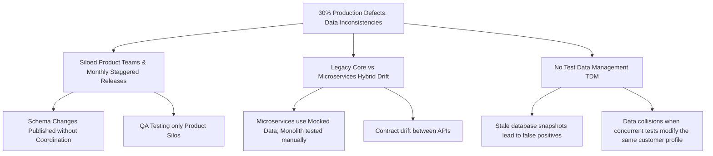
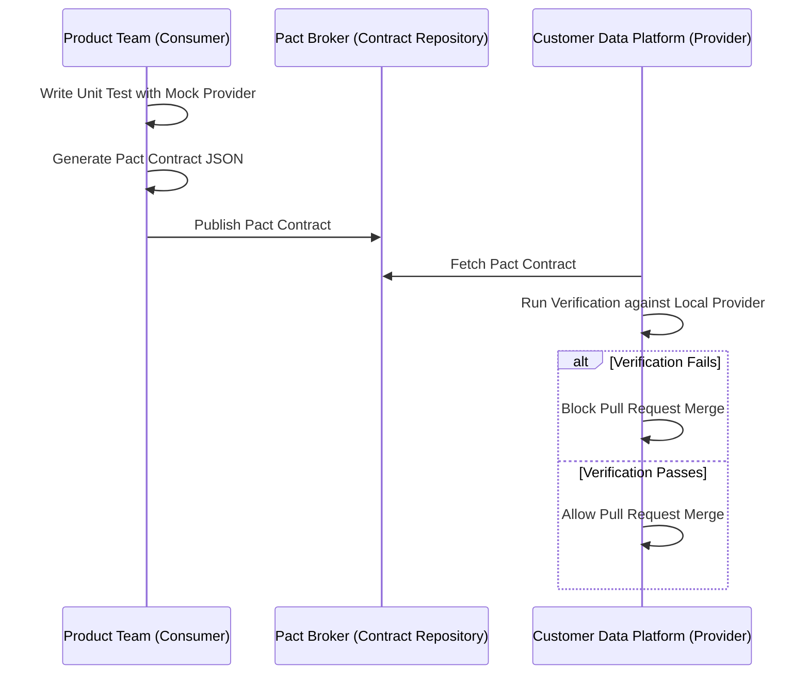
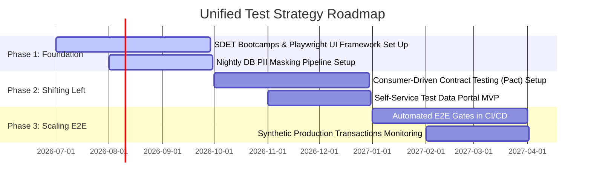

# Unified Test Strategy & QE Investment Proposal
## Multi-Product Financial Services Platform

---

## 1. Executive Summary & Root Cause Analysis

### 1.1 Context
Our organization operates a hybrid-architecture financial platform supporting **Loans, Credit Cards, and Investment Accounts**. While product domains are managed by 5 dedicated product teams, they all consume and publish data via a shared **Customer Data Platform (CDP)**, managed by 2 core platform teams. The platform operates on a hybrid architecture comprised of a legacy monolithic core and new containerized microservices. 

### 1.2 Core Challenges
1. **Critical Quality Gap**: 30% of all production defects are caused by **customer data inconsistencies** across products.
2. **Fragmented Automation**: Test automation exists only for new microservices; legacy modules and cross-product E2E flows are tested manually.
3. **Low Visibility**: Manual E2E test coverage is untracked, incomplete, and highly prone to human error.
4. **Environment & Data Bottlenecks**: Zero investment in Test Data Management (TDM) or automated test environments leads to configuration drift and data collisions.
5. **Scrum Team Constraints**: Each of our 7 scrum teams has 3 developers but only 1 QA, creating a severe manual bottleneck.

### 1.3 Root Cause Analysis (RCA)


---

## 2. The Unified Test Strategy Framework

To resolve the 30% data defect rate and scale automation with our constrained QA-to-Dev ratio (1:3), we will pivot from a fragmented manual approach to a **Shift-Left, Automation-First Unified Strategy**.

```text
       ▲
      ╱ ╲        E2E Flows     (5% - Playwright UI, Synthetic Transactions)
     ╱   ╲
    ╱     ╲      API / Integration (15% - Playwright API, DB Validation)
   ╱       ╲
  ╱  CDC    ╲    Contract Testing (30% - Pact Framework, CDC Pipelines)
 ╱───────────╲
╱    Unit     ╲  Unit / Component (50% - JUnit/Jest/PyTest by Developers)
───────────────
```

### 2.1 The Testing Pyramid Transformation
- **Unit Testing (50% coverage)**: Owned entirely by Developers. Legacy code modifications must include unit test coverage gates (>80%) before merge.
- **Consumer-Driven Contract (CDC) Testing (30% coverage)**: Governs API schemas and event payloads between the 5 product microservices and the 2 customer data teams.
- **API & Database Integration Testing (15% coverage)**: Automates business logic verification, data synchronization, and event-driven updates (Kafka/RabbitMQ payloads).
- **Cross-Product E2E UI Testing (5% coverage)**: Highly focused, automated flows verifying key customer journeys (e.g. "Apply for Loan using Credit Card data").

---

## 3. Solving Customer Data Inconsistencies

The 30% defect rate is caused by schema drift and out-of-sync data replication between the legacy monolith core and microservices. We will resolve this using three specific pillars:

### 3.1 Consumer-Driven Contract (CDC) Testing via Pact
Instead of finding schema mismatches during monthly E2E manual testing, product teams (Consumers) will define their data expectations in a **Contract file** (Pact file) and publish it to a central **Pact Broker**.
- The Customer Data Platform teams (Providers) execute these contracts automatically as part of their CI pipelines.
- If a Customer Data team changes a field schema (e.g., changing `postal_code` to a structured object) that breaks a product team's assumptions, the platform team's build **fails immediately before merge**.



### 3.2 Dual-Write and Event Validation Strategy
For database-level inconsistencies:
- **Transactional Outbox Pattern**: Product microservices must use the Outbox pattern to write business events to their database and a message broker (e.g., Kafka) atomically. This guarantees that customer profile changes are always propagated.
- **Automated Event Schema Registry**: We will enforce Apache Avro/JSON Schema registries. Any event published with an invalid schema is blocked at the broker level.

---

## 4. Scaling End-to-End Automation & Cross-Product Flows

Given that only 1 QA is allocated per team, manual E2E validation is unsustainable. We will build a unified automation framework.

### 4.1 Technology Stack & Shared Repository
- **Tool Selection**: **Playwright with TypeScript**.
  - *Why?* Playwright supports both high-speed API requests (for setup/teardown) and robust UI testing. Its auto-waiting mechanism handles slow legacy monolith pages without brittle sleep statements. TypeScript provides unified type-safety.
- **Repository Architecture**: A single **Shared E2E Git Repository** separate from product code. 
  - Each of the 7 QA engineers contributes to this repository. A dedicated "E2E Guild" will define base page objects and common utilities (e.g. authentication, database connectors).

### 4.2 Synthetic Transactions in Production & Staging
To guarantee cross-product flow reliability, we will deploy **Synthetic Transaction Monitoring**:
- An automated agent runs E2E flows (e.g. customer sign-up -> checking credit eligibility -> checking loan calculator) every 15 minutes in staging and production using isolated synthetic test accounts.
- Any failure sends high-priority alerts to the platform operations dashboard, catching data replication lag before real customers do.

---

## 5. Test Data Management (TDM) Plan

Testing data consistency requires pristine, predictable test data. Manual database provisioning is the primary bottleneck for our monthly releases.

### 5.1 Three-Tier Test Data Strategy
1. **Dynamic Synthetic Data Generation**:
   - For microservices, tests generate mock customer profiles dynamically using libraries like `Faker` combined with predefined JSON schema structures.
2. **Production Database Masking & De-identification**:
   - We will implement an automated pipeline that takes a nightly snapshot of the legacy database, masks all Personally Identifiable Information (PII) using hashing and substitution algorithms, and loads it into a staging database.
3. **Self-Service Test Data Provisioning Portal**:
   - We will build an internal API/dashboard where QA engineers can request a customer profile with specific attributes (e.g., "Customer with active credit card and pending loan application"). The portal locks the record for 30 minutes to prevent test run collisions.

---

## 6. Release Pipeline & Automated Gates

Currently, releases are monthly but staggered, creating integration chaos. We will structure the release pipeline with automated quality gates.

```text
[Feature PR] ---> [Unit & Contract Tests] ---> [Merge to Main] ---> [Staging Deploy] ---> [Automated E2E Gates] ---> [Release to Prod]
```

### 6.1 Automated Quality Gates
Each step in the CI/CD pipeline (GitLab CI/CD or GitHub Actions) must pass strict metrics:

| Pipeline Stage | Gates / Criteria | Action on Failure |
| :--- | :--- | :--- |
| **Pull Request** | - 100% unit tests pass<br>- >80% code coverage<br>- Pact Contract verification passes | Block Merge |
| **Nightly Staging** | - 100% API Integration tests pass<br>- E2E smoke suite passes (Playwright UI) | Block Release Candidate promotion |
| **Release Gate** | - Zero blocker/critical defects open<br>- 100% contract compliance dashboard is green | Automated Rollback / Block deployment |

---

## 7. ROI & Financial Investment Roadmap

### 7.1 Re-skilling & Team Structure (The SDET Transition)
With a 1:3 QA-to-Dev ratio, QA engineers cannot remain manual testers. We must transition them into **SDETs (Software Development Engineers in Test)**.

- **Phase 1 (Months 1-3)**: Playwright & TypeScript training bootcamp for all 7 QAs. 
- **Phase 2 (Months 4-6)**: Embed 1 Lead SDET Architect to oversee framework initialization and test data portal setup.
- **Phase 3 (Month 6+)**: Developers assume responsibility for writing API integration tests, freeing SDETs to focus on cross-product E2E architecture and TDM tools.

---

### 7.2 Staged Implementation Roadmap (12 Months)



---

### 7.3 Financial Investment Plan & ROI Analysis

#### Initial 1-Year Investment
- **Tooling (Pact Broker Enterprise, TDM storage, Playwright Cloud Runners)**: $45,000
- **Training & Bootcamps**: $15,000
- **1x External SDET Consultant (6 months contract)**: $90,000
- **Total Initial CapEx**: **$150,000**

#### Projected Return on Investment (ROI)
- **Defect Cost Reduction**: Resolving 80% of the customer data defects (historically costing ~$180,000 annually in hotfixes, developer overtime, and customer SLA payouts) saves **$144,000/year**.
- **Time Savings**: Automated regression testing reduces monthly release verification from 4 days of manual testing (across 7 QA engineers) to 30 minutes of automated execution. This redirects **~220 hours of engineering capacity per month** back to feature delivery (value equivalent: **~$260,000/year**).
- **Time to Break-Even**: **~5 Months** post-implementation.
